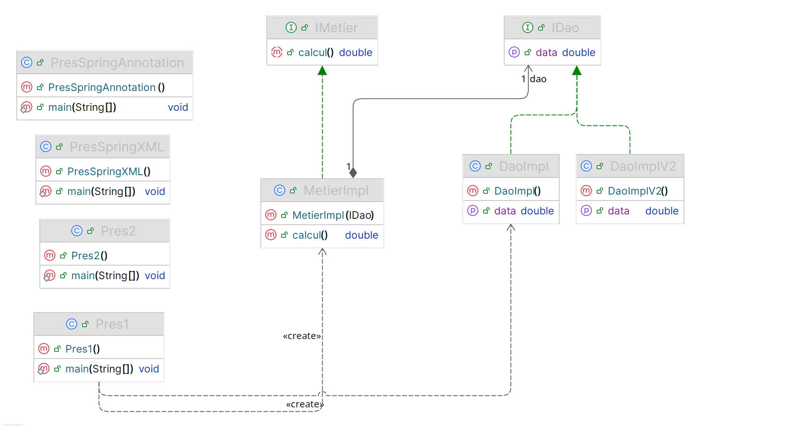

<h2>Injection des Dépendances – Couplage Faible</h2>

<h3>Objectif</h3>

Ce projet a pour objectif d’illustrer le principe de l’injection des dépendances (Dependency Injection) en Java en respectant le principe du couplage faible.

Nous implémentons :

<ul>
  <li>Une couche DAO</li>
  <li>Une couche Métier</li>
  <li>L’injection des dépendances de trois manières :
    <ul>
      <li>Instanciation statique</li>
      <li>Instanciation dynamique</li>
      <li>Framework Spring :
        <ul>
          <li>Configuration XML</li>
          <li>Configuration par annotations</li>
        </ul>
      </li>
    </ul>
  </li>
</ul>

<h3>Diagramme de classes</h3>

Voici le diagramme représentant les relations entre les classes DAO et Métier :

<h3>Injection par instanciation statique</h3>

Dans cette approche, les objets sont créés manuellement dans le code, et les dépendances sont directement injectées via le constructeur ou via setters.

<h3>Injection par instanciation dynamique</h3>

Cette méthode utilise la réflexion pour charger les classes dynamiquement depuis un fichier de configuration.

<h3>Injection avec Spring Framework</h3>

Spring permet de gérer automatiquement les dépendances via un conteneur IoC. Deux méthodes sont illustrées :

<ul>
  <li>Configuration XML</li>
  <li>Configuration par annotations</li>
</ul>

