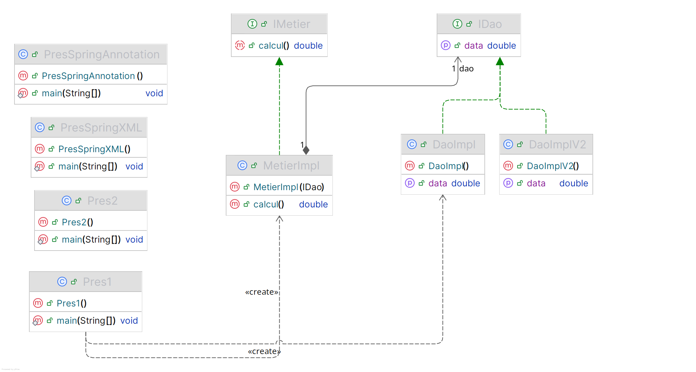
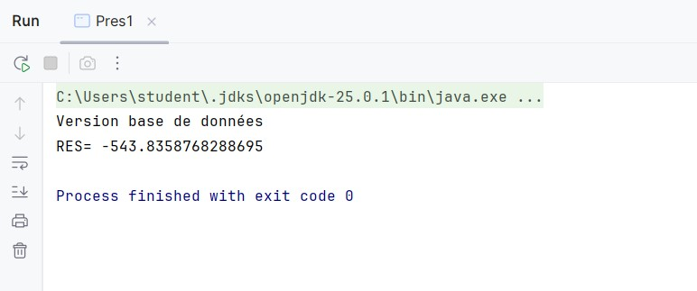
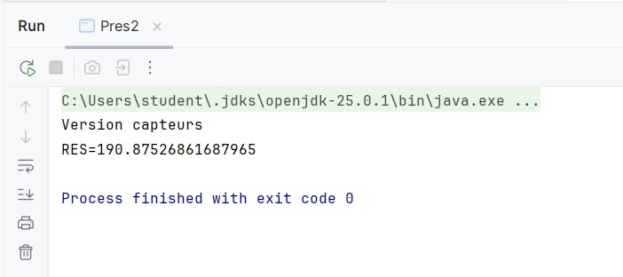
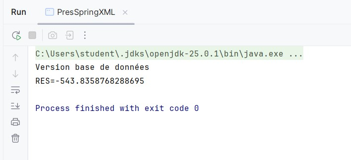
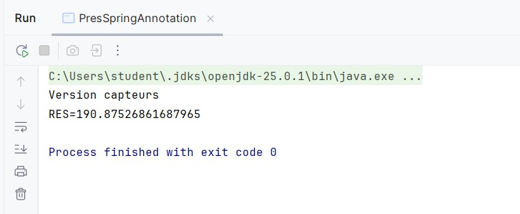

# TP : Inversion de Contrôle (IoC) et Injection des Dépendances (DI)


## Objectif du Projet
Ce projet a pour objectif d’illustrer les principes fondamentaux de l'ingénierie logicielle moderne : l'**Inversion de Contrôle (IoC)** et l'**Injection des Dépendances (DI)**.
L'application est conçue pour être **fermée à la modification et ouverte à l'extension** (Principe Open/Closed) en respectant scrupuleusement le principe du **couplage faible**. Dans ce projet, l'injection des dépendances se fait principalement via le **constructeur**.

---

## Table des matières
1. [Architecture et Conception](#-architecture-et-conception)
2. [Création des couches DAO et Métier](#-création-des-couches)
3. [Injection par instanciation statique](#1-injection-par-instanciation-statique)
4. [Injection par instanciation dynamique](#2-injection-par-instanciation-dynamique)
5. [Injection avec Spring Framework (Version XML)](#3-injection-avec-spring-framework-version-xml)
6. [Injection avec Spring Framework (Version Annotations)](#4-injection-avec-spring-framework-version-annotations)

---

## Architecture et Conception

L'application est divisée en plusieurs couches pour assurer une stricte séparation des responsabilités. Le couplage faible est garanti par l'utilisation d'interfaces.



---

## Création des couches

### 1. Couche DAO (Data Access Object)
Nous avons défini une interface `IDao` et deux implémentations différentes pour prouver que l'application est ouverte à l'extension.

**Interface `IDao` :**
```java
package com.example.dao;

public interface IDao {
    double getData();
}
```

**Première implémentation (Base de données) :**
```java
package com.example.dao;

import org.springframework.stereotype.Repository;

@Repository("d")
public class DaoImpl implements IDao{
    @Override
    public double getData() {
        System.out.println("Version base de données");
        double t = 34;
        return t;
    }
}
```

**Seconde implémentation (Capteurs - Extension) :**
```java
package com.example.ext;

import com.example.dao.IDao;
import org.springframework.stereotype.Repository;

@Repository("d2")
public class DaoImplV2 implements IDao {
    @Override
    public double getData() {
        System.out.println("Version capteurs");
        double t = 12;
        return t;
    }
}
```

### 2. Couche Métier
La classe `MetierImpl` ne dépend que de l'interface `IDao` (Couplage faible). L'injection de la dépendance se fait via le constructeur.

```java
package com.example.metier;

public interface IMetier {
    double calcul();
}
```

```java
package com.example.metier;

import com.example.dao.IDao;
import org.springframework.beans.factory.annotation.Qualifier;
import org.springframework.stereotype.Service;

@Service("metier")
public class MetierImpl implements IMetier {

    IDao dao;

    // Injection des dépendances via le Constructeur
    public MetierImpl(@Qualifier("d2") IDao dao) {
        this.dao = dao;
    }

    @Override
    public double calcul() {
        double t = dao.getData();
        double res = t * 12 * Math.PI / 2 * Math.cos(t);
        return res;
    }
}
```

---

## Les différentes approches d'Injection des Dépendances

### 1. Injection par instanciation statique
L'injection se fait manuellement en dur dans le code. C'est le développeur qui instancie les objets avec le mot-clé `new`.

```java
package com.example.pres;

import com.example.dao.DaoImpl;
import com.example.dao.IDao;
import com.example.metier.IMetier;
import com.example.metier.MetierImpl;

public class Pres1 {
    public static void main(String[] args) {
        IDao d = new DaoImpl();
        IMetier metier = new MetierImpl(d);
        System.out.println("RES= " + metier.calcul());
    }
}
```
> **Aperçu du résultat (Statique) :**
> **

---

### 2. Injection par instanciation dynamique
Afin de ne pas recompiler l'application en cas de changement d'implémentation (ex: passer de `DaoImpl` à `DaoImplV2`), nous utilisons la **réflexion Java**. Les noms des classes sont lus depuis le fichier `config.txt`.

```java
package com.example.pres;

import com.example.dao.IDao;
import com.example.metier.IMetier;

import java.io.File;
import java.util.Scanner;

public class Pres2 {
    public static void main(String[] args) throws Exception {
        Scanner scanner = new Scanner(new File("config.txt"));

        // Instanciation dynamique du DAO
        String daoClassName = scanner.nextLine();
        Class cDao = Class.forName(daoClassName);
        IDao d = (IDao) cDao.newInstance();

        // Instanciation dynamique du Métier avec injection via constructeur
        String metierClassName = scanner.nextLine();
        Class cMetier = Class.forName(metierClassName);
        IMetier metier = (IMetier) cMetier.getConstructor(IDao.class).newInstance(d);

        System.out.println("RES=" + metier.calcul());
    }
}
```
> **Aperçu du résultat (Dynamique) :**
> **

---

### 3. Injection avec Spring Framework (Version XML)
Le framework Spring prend en charge l'IoC. Les objets (Beans) et l'injection via le constructeur sont déclarés dans le fichier `config.xml`.

**Fichier `config.xml` :**
```xml
<?xml version="1.0" encoding="UTF-8"?>
<beans xmlns="http://www.springframework.org/schema/beans"
       xmlns:xsi="http://www.w3.org/2001/XMLSchema-instance"
       xsi:schemaLocation="http://www.springframework.org/schema/beans http://www.springframework.org/schema/beans/spring-beans.xsd">
    
    <bean id="d" class="com.example.dao.DaoImpl"></bean>
    <bean id="metier" class="com.example.metier.MetierImpl">
        <constructor-arg ref="d"></constructor-arg>
    </bean>
</beans>
```

**Classe de présentation :**
```java
package com.example.pres;

import com.example.metier.IMetier;
import org.springframework.context.ApplicationContext;
import org.springframework.context.support.ClassPathXmlApplicationContext;

public class PresSpringXML {
    public static void main(String[] args) {
        ApplicationContext springContext = new ClassPathXmlApplicationContext("config.xml");
        IMetier metier = springContext.getBean(IMetier.class);
        System.out.println("RES=" + metier.calcul());
    }
}
```
> **Aperçu du résultat (Spring XML) :**
> **

---

### 4. Injection avec Spring Framework (Version Annotations)
Approche moderne utilisant les annotations (`@Repository`, `@Service`, `@Qualifier`). Spring scanne le package racine `com.example` pour découvrir les classes, les instancier et résoudre les dépendances automatiquement via les constructeurs.

```java
package com.example.pres;

import com.example.metier.IMetier;
import org.springframework.context.ApplicationContext;
import org.springframework.context.annotation.AnnotationConfigApplicationContext;

public class PresSpringAnnotation {
    public static void main(String[] args) {
        ApplicationContext applicationContext = new AnnotationConfigApplicationContext("com.example");
        IMetier metier = applicationContext.getBean(IMetier.class);
        System.out.println("RES=" + metier.calcul());
    }
}
```
> **Aperçu du résultat (Spring Annotations) :**
> **